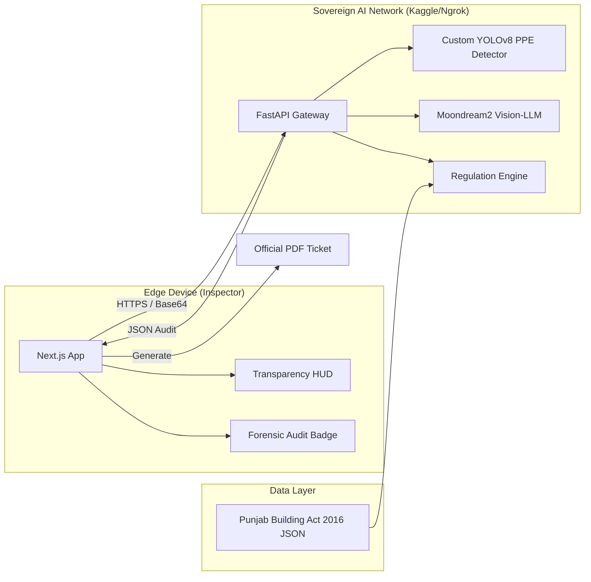
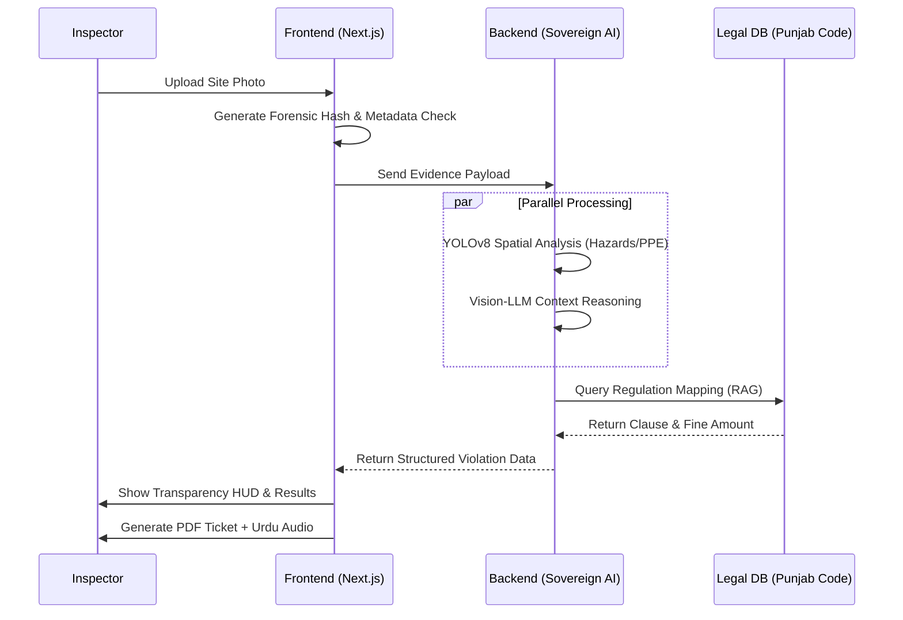
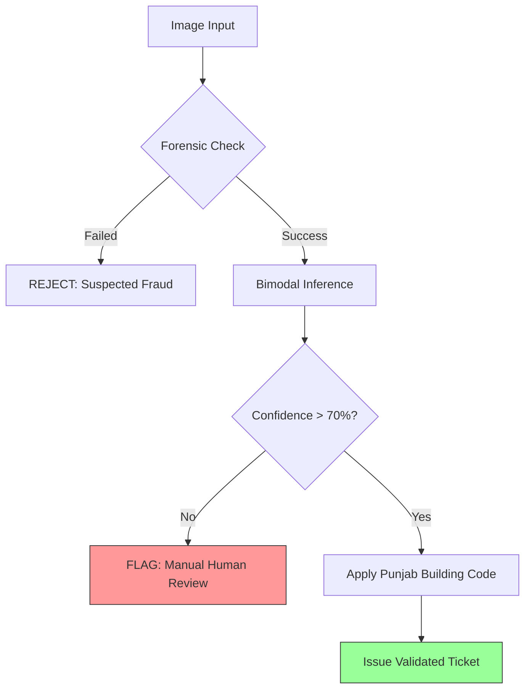

# 📐 APEXGOV 2.0: TECHNICAL DIAGRAMS (Mermaid.js)
*Use these codes in the Mermaid Live Editor (mermaid.live) to generate high-res images for your Miro board/Deck.*

---

## 1. High-Level Architecture (The Ecosystem)

## 2. Sequence Diagram (The Audit Cycle)

## 3. The "Reliability" Data Flow

